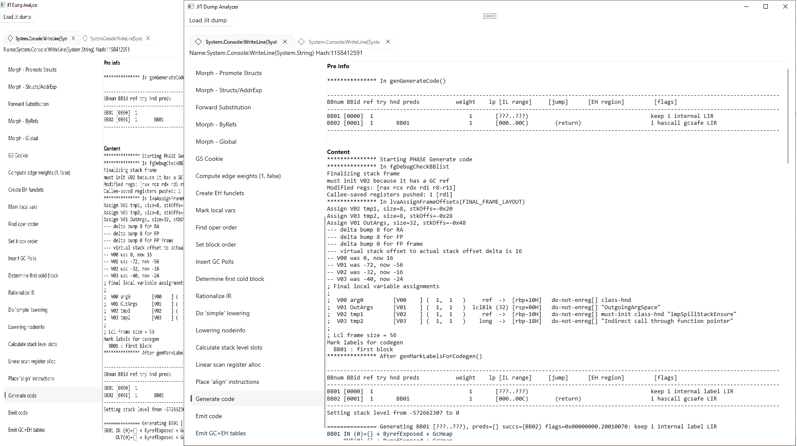

# C# JIT Dump Analyser

Small application to make navigation of dumps a bit more tolerable

More about JIT Dumps [in official .NET repo](https://github.com/dotnet/runtime/blob/main/docs/design/coreclr/jit/viewing-jit-dumps.md)

## Screenshots

